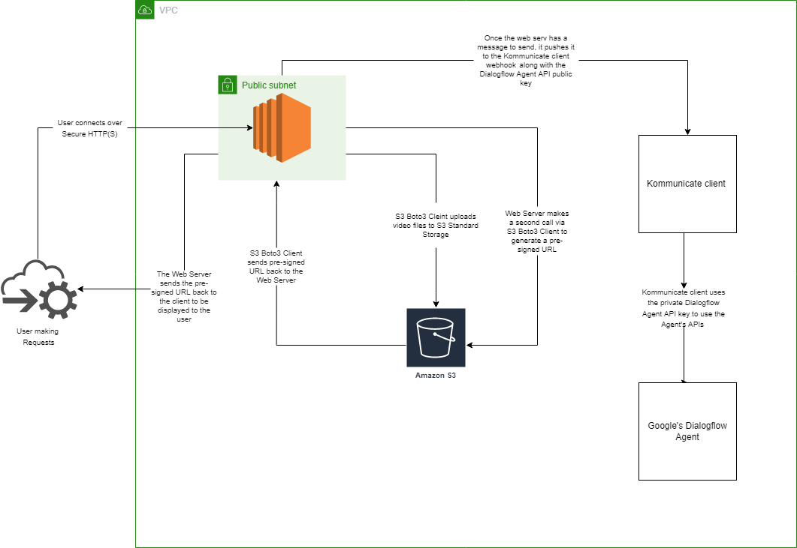

# ClowdyHacks Final Project

## Assignment Requirements

- Create a cloud serviced application
- utilize a technology we did **not** learn during the classroom

## General Purpose

Website to download youtube videos

## Perks of our Application

- Download YouTube videos
- A chat bot from Gcloud
- Serve PHP and python scripting through an AWS EC2 instance
- deliver unique links to the user to download any YouTube video
- AWS S3 storage for video hosting

# Description and Architecutre of ClowdyHacks!

## Overall

We are using an ec2 instance configured with a self-signed certificate so that we can transmit data over https. The server is utilizing Nginx as a reverse proxy to forward requests to the requested page. We are also using PHP to display our webpage and listen for POST requests. 

## The Breakdown

- Once a POST request is detected (i.e. the download button being pressed) PHP gets the value for the YouTube link from the HTML element’s name attribute. 
- PHP then executes a python script via the “passthrough” function passing in the user’s YouTube URL. Execution flow transitions to the Python script where we utilize a Python library PyTube to download the YouTube video to the local filesystem (the EC2 Instance). 
- We use the sys python library to extract the argument that was passed in by PHP. Next, we utilize python’s boto3 library for connectivity to AWS services. 
- We chose to utilize s3 for our video storage. We call the s3.upload_file passing in the local mp4 file, the name of our bucket, and the name of our s3 object. 
- Next, we utilize the python os library to remove the file from the filesystem. 
- Then, we utilize boto3 again to connect to s3 and generate a pre-signed URL. We can specify an expiration date for the pre-signed url. The pre-signed URL gives us an easy way for the user to view and download their YouTube video. 
- Lastly, we return the pre-signed URL back to the client for the user to view. The user is able to navigate to the link via the pre-signed URL, where they are able to view the video in the cloud and download the video to their local filesystem, by right clicking and selecting “save video as.” 

## Additional Functionality

- Our chat bot utilizes Google’s Dialogflow CX agent, where we integrate it with Kommunicate for an aesthetically pleasing UI and the ability to take over chat bot communication from users. We provide the Kommunicate platform with our Dialogflow API private key. Integration into our website consists of uploading a script which contains the public key as well as the webhook for our website to push messages to.

# Created by

Zaquariah Holland, Ivan Castro, Luis Banda, Travis Sauer

# Created with

- AWS
- Gcloud
- Python
- PHP
- HTML

# Resources
- [S3 Boto3](https://boto3.amazonaws.com/v1/documentation/api/latest/reference/services/s3.html)
- [Google Dialogflow](https://cloud.google.com/dialogflow/docs)
- [Video Demo](https://www.youtube.com/watch?v=XJxNFb2y3fw)
